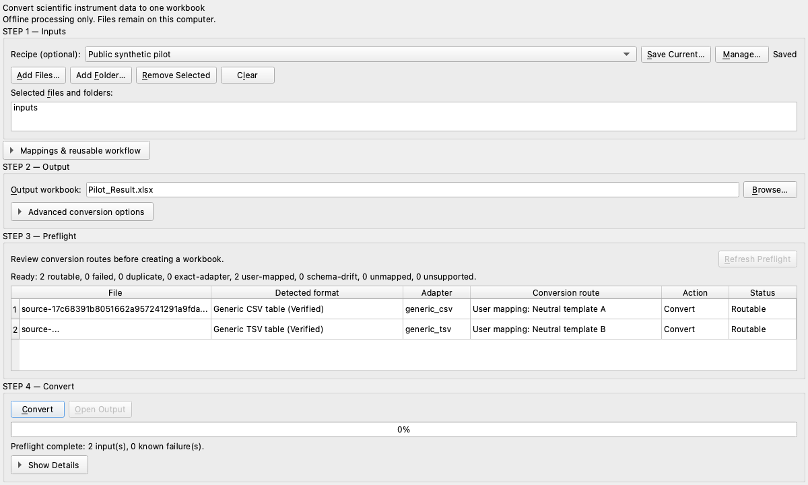

# Ordifile

[English](README.md)

[](https://github.com/hdkim99/ordifile/actions/workflows/ci.yml)
[](https://pypi.org/project/ordifile/)
[](pyproject.toml)
[](LICENSE)

과학 장비 결과를 일괄 변환·통합하여 하나의 깔끔하고 정돈되며 감사 가능한
Excel workbook으로 만듭니다.

Ordifile의 proprietary 형식 방향은 **result-first**입니다. 근거가 확보된 Agilent,
Shimadzu, YoungIn, LECO retention time·area result를 동일한 `Peaks` / `Peak_Matrix` workbook
model로 통합하며 raw signal은 별도로 검증하는 선택 기능입니다. Result
export만 있어도 raw file 없이 변환할 수 있습니다. Vendor result adapter는 각각의
exact format reader로 분리하지만, 검증된 peak row는 canonical 변환
후 모두 동일하게 동작합니다. 실제 result fixture로 field 경계와 의미가 확인되기
전에는 vendor result parser 지원을 주장하지 않습니다.

**안정적으로 검증된 형식:** Ordifile 문서 스키마를 사용하는 CSV, TSV, 세미콜론 구분
TXT, 감사된 non-macro XLSX. 현재 개발 source tree에는 아래에 설명한 범위가 매우 좁은
proprietary Experimental reader 여덟 개도 포함되며, 이는 제조사 형식 전체 지원을 뜻하지
않습니다. 공개된 version은 PyPI badge에서 확인할 수 있습니다.


```text
sample_1.csv   sample_2.tsv   exported_peaks.xlsx
          \          |          /
           ordifile convert ...
                    |
                    v
          Ordifile_Result.xlsx
          ├── Manifest
          ├── Samples
          ├── Peak_Matrix
          ├── Peaks
          ├── Metadata
          └── Import_Log
```

## 설치

PyPI에서 현재 공개된 최신 Ordifile release를 설치합니다. 위 PyPI badge에서 현재 공개
version을 확인할 수 있습니다. `main`의 README에는 [Unreleased](CHANGELOG.md) 기능도
포함될 수 있으며, `pip install`은 badge에 표시된 공개 version을 설치합니다.

```bash
python -m pip install ordifile
```

Experimental desktop interface는 optional extra로 제공하므로 기본 CLI/API 설치에는
Qt runtime dependency가 추가되지 않습니다.

```bash
python -m pip install "ordifile[gui]"
ordifile-gui
```

이는 Python package GUI이며 standalone `.exe` 또는 `.app`은 아닙니다.

## 빠른 시작

```bash
python -c "from pathlib import Path; p=Path('ordifile_demo'); p.mkdir(exist_ok=True); [(p / f'sample_{n}.csv').write_text(f'sample_id,retention_time,area,compound\nsample_{n},{n / 10:.1f},{n * 10},demo\n', encoding='utf-8') for n in (1, 2, 10)]"
ordifile convert ordifile_demo --sort filename --output Ordifile_Result.xlsx
```

이 패키지 독립적인 합성 예제의 실제 결과 요약은 다음과 같습니다.

```text
Input paths: 1
Discovered files: 3
Processed 1/3: success sample_1.csv
Processed 2/3: success sample_2.csv
Processed 3/3: success sample_10.csv
Export started: Ordifile_Result.xlsx
Output ready: Ordifile_Result.xlsx
Status: success
Output: Ordifile_Result.xlsx
Successful files: 3
Files with warnings: 0
Failed files: 0
Skipped files: 0
Duplicate files: 0
Samples: 3
Peaks: 3
Scientific signal series: 0
Structural record series: 0
Sort requested: filename
Sort used: filename
Sort reason: User requested filename ordering.
Sheets: Manifest, Samples, Peak_Matrix, Peaks, Metadata, Import_Log
```

입력 파일은 수정하지 않습니다. 자연 파일명 정렬은 `sample_10`보다 `sample_2`를
먼저 배치합니다.


## Experimental desktop interface

선택형 desktop interface는 **Add Files**, **Add Folder**, local file-manager drag and
drop을 제공하며, CLI와 동일한 공개 registry와 pipeline으로 authoritative format
inspection을 수행합니다. 기존 5개 sort mode와 `.xlsx` output을 선택하면 background
worker가 변환하고 파일별 성공·경고·실패와 progress를 계속 표시합니다.



이 interface는 offline-only이며 upload, cloud, telemetry, embedded browser,
vendor-executable integration이 없습니다. 기존 workbook을 조용히 덮어쓰지 않습니다.
Drag and drop과 동등한 keyboard 경로를 Add button, visible label, focus order,
accessible name으로 제공합니다. 강제 Cancel은 workbook transaction safety를 보존하는
공개 core contract가 생길 때까지 의도적으로 제외합니다. Issue #6에는 현재 유지관리자
전용 unsigned standalone prototype이 있으며 [standalone 절차](docs/standalone.md)에
문서화했습니다. `.exe`/`.app` 공개 release는 아직 없습니다. Publisher identity, signing,
notarization, LGPL replacement/relinking 근거와 최종 재배포 gate가 해결되기 전에는
BLOCKED이며, 위 Python package GUI가 지원되는 설치 경로입니다.

## 검증된 형식

| 내장 형식 | Metadata | Peaks | Signals | 상태 | 합성 fixture |
|---|---:|---:|---:|---|---:|
| 일반 comma CSV | 예 | 명시적 열 | 명시적 `time` + `signal` 행 | 검증됨 | 예 |
| 일반 tab TSV | 예 | 명시적 열 | 명시적 `time` + `signal` 행 | 검증됨 | 예 |
| 일반 semicolon TXT | 예 | 명시적 열 | 명시적 `time` + `signal` 행 | 검증됨 | 예 |
| 일반 non-macro XLSX 표 | 예 | 명시적 열 | 명시적 `time` + `signal` 행 | 검증됨 | 예 |

여기서 “일반”은 첫 행이 [문서화된 열 schema](docs/formats/generic-tabular.md)를
사용한다는 뜻이며 임의의 제조사 export를 의미하지 않습니다. 확장자는 보조 근거일
뿐이며 내용과 schema도 함께 확인합니다. 현재 환경의 adapter는
`ordifile formats`로 확인할 수 있습니다.

### 미지원 Peak Table 열을 직접 mapping

정확한 profile adapter가 없어도 정돈된 CSV, TSV, semicolon-TXT 또는 audited XLSX
Result 표에 RT와 Area 열이 명시되어 있다면 desktop의 **Map Peak Columns** 또는 CLI
mapping JSON을 사용할 수 있습니다.

```console
ordifile convert run001.csv run002.csv --peak-mapping peak-map.json -o results.xlsx
ordifile convert input/ --recursive --peak-mapping-set lab-mappings.json -o results.xlsx
```

Mapping은 모든 header를 분류하고 RT unit과 Area unit 상태를 사용자가 확인해야 합니다.
Ordifile은 source 행 순서를 보존하며 내장 Result adapter와 같은 `PeakRecord` → `Peaks` →
ordered matrix → workbook 경로를 사용합니다. RT, Area, unit, compound, vendor를 자동
추론하지 않습니다. Manufacturer/software 값은 사용자 제공 provenance일 뿐 검증된
호환성이 아니며 vendor 지원 표에 추가되지 않습니다. Mapping Set은 사용자가 승인한 여러
template을 exact format/header 구조로 한 batch에서 재사용하며, 0개 또는 여러 profile이
일치하면 fallback 없이 실패합니다. [명시적 mapping 계약](docs/formats/explicit-peak-table-mapping.md)을
참고해 주세요.
저장된 구조가 달라지면 bounded 진단은 고정된 구조 차이만 설명하고 후보를 자동 적용하지
않습니다. Desktop에서 사용자가 mapping을 다시 확인하면 기존 template을 보존한 채 새
profile을 만들 수 있습니다.

### 쓰기 전 변환 검토

동일한 변환 option에 `--dry-run`을 추가하면 deterministic route-only preflight를
생성합니다. Exact adapter, 사용자 mapping, generic route, drift, ambiguity, unsupported
입력, duplicate, 현재 primary output conflict를 보고하지만 workbook, sidecar, temporary
file 또는 `PeakRecord`는 만들지 않습니다.

```console
ordifile convert input/ --recursive --peak-mapping-set lab-mappings.json \
  --output results.xlsx --dry-run
```

Python의 in-memory `ConversionPlan`은 같은 process 안에서 사용하는 immutable
snapshot입니다. Content SHA-256 identity와 고정 routing decision은 보관하지만 scientific
row와 공개 absolute path는 보관하지 않습니다. `convert_plan(plan)`은 discovery와 routing을
다시 수행하고 source set/content, adapter inventory, configuration 또는 output state가
달라지면 기존 converter를 실행하기 전에 stale plan을 거부합니다. 이는 bounded TOCTOU
hardening이며 filesystem state가 절대 변하지 않는다는 보장은 아닙니다. Scientific sort
결과와 workbook/sidecar capacity는 parsing/export planning까지 명시적으로 deferred됩니다.
Dry-run은 peak 수나 미래 write permission을 예측하지 않습니다. Mapping Profile matching은
header-only입니다. Exact adapter ownership probe는 필요에 따라 numeric row syntax를 포함한
bounded source structure를 decode·validate할 수 있지만, preflight는 canonical scientific row를
생성·저장·export하지 않습니다. Freshness용 whole-file hash는 measurement bytes가 바뀌면
자연히 달라질 수 있습니다. Public plan-summary SHA-256은 privacy-safe projection만 나타내며
private path/config binding이나 authentication을 뜻하지 않습니다. 실행 가능한 plan에는 새
output target이 필요하고, 명시적 overwrite는 direct conversion에서만 사용할 수 있습니다.
POSIX에서는 sticky bit 없이 group/world-writable인 output directory를 거부합니다. 다른
사용자가 private transaction entry를 교체할 수 있기 때문입니다. 같은 운영체제 사용자로
실행되는 process는 local trust boundary 안에 있습니다.

```python
from ordifile.api import convert_plan, plan_conversion

plan = plan_conversion("input", "results.xlsx")
if plan.is_executable:
    result = convert_plan(plan)
```

### 연구실 변환 Recipe 재사용

`ConversionRecipe`는 **어떤 scientific file을 변환하는지**가 아니라 **어떻게
변환하는지**를 저장합니다. Strict하고 bounded된 UTF-8 JSON이며 discovery, routing,
sorting, signal, failure, sidecar와 선택적 embedded Mapping/Mapping Set 설정만 포함합니다.
Input/output path, overwrite 승인, source identity, plan, scientific row는 저장하지 않습니다.
Schema v1의 최대 크기는 8 MiB이며 embedded Mapping Set은 기존 4 MiB/32-profile 제한을
그대로 유지합니다. 알 수 없는 key, 중복 key, 잘못된 형식은 거부합니다.

```console
ordifile convert new-experiment/ --recipe laboratory-recipe.json \
  --output results.xlsx --dry-run
ordifile convert new-experiment/ --recipe laboratory-recipe.json \
  --output results.xlsx
```

Recipe conversion은 항상 기존 `ConversionPlan`을 만들고 재검증합니다. Exact adapter
우선권, exact Mapping Profile matching, drift diagnostic, ambiguity failure를 우회하지
않습니다. Recipe에 저장된 adapter는 exact-profile adapter가 input을 소유하지 않을 때만
검토됩니다. Input과 output은 runtime에 별도로 지정합니다. Effective configuration을
명확히 유지하기 위해 `--recipe`는 `--recursive`, `--sort`, `--adapter`, `--sheet`, mapping
flag 같은 별도 behavior option과 함께 사용할 수 없습니다. `--dry-run`과 `--verbose`는
runtime 표시 선택으로 유지됩니다. Recipe는 overwrite 승인을 저장하지 않습니다.

Embedded mapping에는 exact header, worksheet title, unit, local label, 사용자 제공
manufacturer/software 선언이 들어갈 수 있습니다. Recipe JSON은 privacy-bearing local
configuration으로 관리하고 public issue에 첨부하지 마세요. Exact semantic SHA-256은
local-only입니다. Plan과 workbook의 Recipe-specific provenance는 Recipe schema와
privacy-safe public fingerprint로 제한됩니다. 기존 scientific 및 Mapping provenance는
기존 workbook contract를 유지합니다. 단, Recipe에 embedded된 single Mapping의 private
semantic digest는 기록하지 않습니다. 어떤 Recipe digest도 vendor 지원이나 workbook byte
identity를 증명하지 않습니다.

```python
from ordifile import ConversionRecipe, save_conversion_recipe
from ordifile.api import convert_plan, plan_recipe
from ordifile.core.models import SortMode

recipe = ConversionRecipe(sort=SortMode.INPUT_ORDER)
save_conversion_recipe(recipe, "laboratory-recipe.json")
plan = plan_recipe("new-experiment", "results.xlsx", recipe=recipe)
if plan.is_executable:
    result = convert_plan(plan)
```

## Experimental proprietary adapter

| 형식 경계 | Metadata | Peaks | 출력 | 상태 | 실제 fixture |
|---|---:|---:|---|---|---:|
| Agilent ChemStation `.CH` internal version 181, exact GC-FID profile | 필드별 | 없음 | 모든 구조적 decoded record | Experimental | 외부 BSEE 파일 1개 |
| Agilent ChemStation Result XML, exact `C.01.10 [201]` 단일 `FID1/A` Percent/Area profile | 과학 데이터 allowlist | ResultsGroup peak | RT (min) + area (pA\*s) + height (pA), raw signal 없음 | Experimental | 외부 CeCILL-2.1 fixture 1개 |
| Shimadzu LabSolutions 5.82 `.GCD`, GC-2014 / 단일 `SFID1` profile | 필드별 | 없음 | retention time (min) + signal (uV) | Experimental | 외부 CC0 선언 파일 1개 + 같은 run ASCII reference |
| Shimadzu LabSolutions result ASCII, exact 5.82 GC-2014 / 단일 `SFID1` `Ch1` profile | 과학 데이터 allowlist | Peak Table 행 | RT/start/end (min) + area + height (unit 미확정), raw signal 없음 | Experimental | 외부 controlled-CI fixture 1개 + 같은 run GCD |
| Shimadzu GCMSsolution `.QGD`, exact `4.00` TIC profile | 필드별 | 없음 | retention time (min) + raw TIC (unit 미확정), MS1 미출력 | Experimental | 외부 Dryad CC0 파일 1개 |
| YoungIn YL-Clarity `.PRM`, exact observed `9.0.1.19` profile | 구조적 allowlist | 없음 | stored-label channel + 순서 보존 raw binary32 record, time axis/unit 없음 | Experimental | 사용자 제공 local-only 파일 23개 |
| YoungIn YL-Clarity Result Table, exact owner-validated CP949/tab `.csv` profile | 과학 데이터 allowlist | source peak 행 | RT (min) + area (mV.s) + height (mV), raw signal 없음 | Experimental | 사용자가 생성한 local-only export 2개 |
| LECO ChromaTOF 4.72.0.0 GCxGC Result text, exact observed profile | 과학 데이터 allowlist | source peak 행 | RT1/RT2 (s) + area/height (AU), raw signal 없음 | Experimental | 외부 Dryad CC0 non-human 파일 1개 |

이 Experimental adapter들은 아래의 정확한 기능 경계를 가집니다. 검증되지 않은
profile은 넓게 해석하지 않고 거부합니다.

Agilent `.CH` adapter는 모든 decoded record를
원래 순서대로 유지합니다. x는 retention time이 아닌 `decoded_record_index`, y는 물리
scale이 적용된 intensity가 아닌 `decoded_raw_integer`입니다. Unit, scientific point
count, 마지막 record의 역할은 아직 미확정입니다. 다른 `.CH` version, `.D` directory,
TCD, MS, peak, 보정값, 쓰기 기능은 지원한다고 주장하지 않습니다. [정확한 기능·안전
경계](https://github.com/hdkim99/ordifile/blob/main/docs/formats/agilent-chemstation-ch-v181.md)를 확인해 주세요.

별도 Agilent Result XML adapter는 raw sibling 없이 정확한 ChemStation
`C.01.10 [201]`, 단일 `FID1/A`, `Percent`/`Area` report profile 하나를 읽습니다.
Canonical `ResultsGroup/Peak` 행을 source 순서대로 보존하고 min, pA\*s, pA unit과
integration 시작·종료를 유지하며, RT/area/height decimal string을 중복
IntegrationResults 행과 전부 대조합니다. 비어 있지 않은 calibrated `Name`은
`compound`로 매핑하고 source label `FID1`/`A`와 canonical detector/channel
`FID`/`FID1A`를 구분합니다. 다른 revision, multiple signal, detector, quantitation
mode, raw chromatogram, 쓰기 기능은 거부하거나 지원하지 않습니다. 개인정보성 run
metadata 때문에 실제 fixture는 controlled CI에서만 사용합니다. [정확한 기능·안전
경계](https://github.com/hdkim99/ordifile/blob/main/docs/formats/agilent-chemstation-result-xml.md)를 확인해 주세요.

Shimadzu adapter는 LabSolutions 5.82, GC-2014, 단일 `SFID1`, `uV`, identity-factor
profile로 한정됩니다. 66,255개 retention-time·signal 값 전부를 같은 run의
LabSolutions ASCII reference와 비교했습니다. 다른 LabSolutions/GCsolution version,
detector, channel, factor, GCD profile, peak, `.QGD`, `.LCD`, 쓰기 기능은 지원한다고
주장하지 않습니다. [정확한 기능·안전 경계](https://github.com/hdkim99/ordifile/blob/main/docs/formats/shimadzu-gcsolution-gcd.md)를 확인해 주세요.

별도 Shimadzu result ASCII adapter는 raw sibling 없이 정확한 LabSolutions 5.82,
GC-2014, 단일 `SFID1` / `Ch1` export 하나를 읽습니다. Source `Peak#`와 별도의 source
observation order를 모두 보존하고 `R.Time`, `I.Time`, `F.Time`을 각각 retention/start/end
time(min)으로 매핑하며, area와 height는 물리 unit을 만들지 않고 보존합니다. Exact
fixture에는 compound ID와 name이 없으므로 compound identity를 출력하지 않습니다.
내장된 private metadata는 내보내지 않고 public source에는 SHA-256 alias를 사용합니다.
다른 software version, instrument, detector, channel, identified-compound table, multiple
peak section, 임의 LabSolutions text export는 지원하지 않습니다. [정확한 기능·안전
경계](https://github.com/hdkim99/ordifile/blob/main/docs/formats/shimadzu-labsolutions-result-ascii.md)를 확인해 주세요.

별도 QGD adapter는 정확한 GCMSsolution `4.00` compound-file profile 하나로
한정됩니다. 16,800개 TIC 정수와 millisecond에서 검증된 retention-time axis를
그대로 보존하며 TIC의 물리 unit은 미확정입니다. MS1 block은 bounded scan 구조와
TIC 합 일치를 검증하지만 spectrum을 출력하지 않고 encoded mass를 m/z라고 부르지
않습니다. 다른 QGD version, SIM/MRM, 물질 식별, 정량, 쓰기 기능은 지원한다고
주장하지 않습니다. [정확한 기능·안전 경계](https://github.com/hdkim99/ordifile/blob/main/docs/formats/shimadzu-gcmssolution-qgd.md)를 확인해 주세요.

YoungIn adapter는 YL-Clarity `9.0.1.19` PRM profile 하나를 위한 구조 변환기입니다.
Local-only 파일 23개의 현재 block 43개에서 유한한 stored binary32 record 563,240개를
순서대로 보존하고, 파일에 저장된 allowlisted FID/TCD label로 channel을 분리하지만
canonical detector field는 비워 둡니다. x는 retention time이 아니라 record ordinal이며,
physical scaling이나 unit을 적용하지 않고 peak도 내보내지 않습니다. 사용자가 제공한
FID/TCD grouping은 local maintainer oracle에만 남고 runtime metadata로 출력되지 않습니다.
Runtime sample ID도 파일명이 아닌 content hash로 생성됩니다. 다른 PRM generation,
recovery `.RAW`, Autochro, calibrated chromatogram, 쓰기 기능은 지원한다고 주장하지
않습니다. [정확한 기능·안전 경계](https://github.com/hdkim99/ordifile/blob/main/docs/formats/youngin-yl-clarity-prm-raw.md)를 확인해 주세요.

별도 YoungIn Result adapter는 사용자가 생성한 export 2개로 확정한 정확한
CP949-compatible tab-delimited Result Table 문법만 읽습니다. PRM 없이 explicit RT(min),
area(mV.s), height(mV), signal number/name, source order가 있는 실제 행 6개를 보존합니다.
관측된 FID section 하나는 명시적으로 peak가 없고, peak가 있는 TCD section 두 개는
서로 다른 channel stream으로 유지됩니다. `Signal Name`을 detector identity로 승격하지
않으며 W05를 integration boundary로 해석하지 않고 Total/percentage/empty compound-table
행도 peak로 만들지 않습니다. Bytes 안에는 OEM/version marker가 없으므로 더 넓은
YL-Clarity/Clarity CSV 지원은 주장하지 않습니다. [정확한 기능·안전 경계](https://github.com/hdkim99/ordifile/blob/main/docs/formats/youngin-yl-clarity-result-csv.md)를 확인해 주세요.

LECO adapter는 Dryad CC0 non-human model-mixture 파일로 확정한 정확한 ChromaTOF
4.72.0.0 GCxGC tab-delimited Result profile 하나를 읽습니다. Source 100행의 1차·2차원
retention time(s), area/height의 문서화된 arbitrary unit(`AU`), source order, name,
spectra text, width 값과 retention-index lexeme를 보존합니다. `Peak_Order_Matrix_2D`는
RT1/RT2/area atomic triple을 유지하며 기존 1D matrix는 바꾸지 않습니다. Software
version은 bytes 내 marker가 아니라 외부 dataset provenance이고 detector/channel을
만들지 않으며 spectra를 지원되는 mass-spectral data로 주장하지 않습니다. 더 넓은
LECO, ChromaTOF, Sync, CSV, TXT 또는 GCxGC 지원은 주장하지 않습니다. [정확한 기능·안전
경계](docs/formats/leco-chromatof-472-gcxgc-result-txt.md)를 확인해 주세요.

## CLI

출력 없이 파일 하나를 검사합니다.

```bash
ordifile inspect sample.csv
ordifile inspect exported.xlsx --sheet PeakTable --verbose
```

파일이나 폴더를 변환합니다.

```bash
ordifile convert sample_1.csv sample_2.tsv --output Ordifile_Result.xlsx
ordifile convert ./exports --recursive --sort acquired_at --include-signals \
  --output Ordifile_Result.xlsx
ordifile convert ./exports --extension .csv --extension .xlsx \
  --sheet-mode sidecar-csv --output Ordifile_Result.xlsx
ordifile convert ./exports --recursive --output Ordifile_Result.xlsx --dry-run
ordifile convert ./exports --recipe laboratory-recipe.json \
  --output Ordifile_Result.xlsx --dry-run
```

주요 동작은 다음과 같습니다.

- 기존 출력은 `--overwrite`가 없으면 덮어쓰지 않습니다.
- `--dry-run`은 bounded routing/output preflight만 수행하며 workbook과 sidecar를 만들지 않습니다.
- 폴더 탐색은 기본적으로 비재귀이며 `--recursive`로 하위 폴더를 포함합니다.
- `--on-error continue`는 정상 파일을 보존하고 부분 성공을 보고합니다.
- `--on-error stop`은 첫 파일 실패 후 중단하며 workbook을 쓰지 않습니다.
- `--adapter`는 adapter를 강제하고 `--sheet`는 XLSX worksheet를 선택합니다.
- `--peak-mapping FILE.json`은 batch의 일치하는 generic 표에 하나의 엄격한 local
  사용자 확인 mapping을 적용합니다.
- `--peak-mapping-set FILE.json`은 서로 다른 generic template을 재사용 가능한 exact 구조
  profile로 routing하며 `--adapter`, `--peak-mapping`과 동시에 사용할 수 없습니다.
- `--recipe FILE.json`은 self-contained local configuration을 불러오고 항상 preflight를
  사용합니다. Input/output은 runtime 값이며 별도 behavior flag는 거부됩니다.
- signal이 있어도 `--include-signals`를 지정해야 workbook에 기록합니다.
- `--verbose`는 검출 근거와 상세 구조화 진단을 표시합니다.

자동화를 위한 exit code는 다음과 같습니다.

| Code | 의미 |
|---:|---|
| 0 | 실패 없이 workbook 생성 또는 dry-run 준비 완료 |
| 1 | 치명적/blocked 결과 또는 성공 입력 없음 |
| 2 | 사용법 또는 설정 오류 |
| 3 | 실패가 있는 유효 workbook 또는 known partial failure가 있는 dry-run |
| 130 | 사용자 중단 |

## 정렬

`--sort auto`는 모든 성공 파일에 신뢰 가능한 timezone-aware 측정시각이 있을 때만
측정시각을 사용합니다. 그렇지 않으면 완전한 sequence 번호, 자연 파일명 순으로
fallback합니다. 명시적 모드는 `acquired_at`, `sequence`, `filename`,
`input_order`입니다. 누락되거나 신뢰할 수 없는 값은 기록된 filename fallback을
사용합니다.

요청한 모드, 실제 모드, 사유, 파일별 sort key가 workbook에 기록됩니다.

## Workbook 구조

| Sheet | 내용 |
|---|---|
| `Manifest` | 버전, UTC 생성시각, 개수, 옵션, 정렬, 제한, 경고, sidecar |
| `Samples` | 발견된 입력별 한 행, 상태, 공개 source reference(기본 상대 경로 또는 core hash alias), adapter, peak 수, SHA-256 |
| `Peak_Matrix` | 명시적 성분명이 있을 때만 시료별 wide format; 중복 peak는 분리 |
| `Peak_Order_Matrix` | sample/source/manufacturer/detector/channel/unit과 source 순서 RT/area pair; Excel limit 전에 pair 단위로 분할 |
| `Peak_Order_Matrix_2D` | 2차원 stream만 RT1/RT2/area 원자적 triplet으로 보존하는 조건부 sheet; 기존 1D pair 의미는 변경하지 않음 |
| `Peaks` | manufacturer와 근거가 있는 unit/boundary를 포함하는 모든 명시적 peak의 long format; 2D data가 있을 때만 secondary retention 열을 추가하며 RT 기반 성분 추론 없음 |
| `Metadata` | 알 수 없는 필드, 잘못된 raw lexeme, 원래 provenance |
| `Import_Log` | 공개 source reference, 성공·경고·실패·중복·제외 파일, sort key, hash |
| `Signals_<channel>` | 실제 파싱되고 요청된 경우에만 원본 비보간 x/y 값 |
| `Signals_Records_<channel>` | retention-time signal이 아닌 Experimental 구조 decoded record |

Workbook은 `Manifest`를 첫 audit tab으로 유지하지만 연구자 진입점인 `Samples`를
처음 표시합니다. Header는 고정 style을 사용하고, scroll 중 identity 열을 고정하며,
관련 long-form sheet에는 filter를 적용합니다. 열 너비는 private value를 scan하지 않는
bounded schema 규칙으로 정합니다. Scientific numeric cell은 Excel `General` 표시를
유지하므로 RT, Area, Height를 반올림하거나 정규화하지 않습니다. Manifest에는
sample/peak/series의 count-only 완료 요약도 기록합니다. Revalidated preflight에서 실행된
conversion은 plan schema와 public plan-summary SHA-256만 기록하며 plan 자체는 포함하지
않습니다.
Conversion Recipe를 사용하면 Recipe-specific Manifest provenance에는 Recipe schema version과
public-safe configuration fingerprint만 추가됩니다. 기존 scientific 및 Mapping provenance는
기존 contract를 유지하지만 Recipe에 embedded된 single Mapping의 private semantic digest는
반복 기록하지 않습니다. Recipe JSON, local Recipe path/label, exact local Recipe semantic
digest, raw mapped header, raw Recipe worksheet title은 포함하지 않습니다.

Excel 제한에 도달하기 전에 행과 열을 결정적인 numbered sheet로 나눕니다. 데이터를
조용히 자르지 않습니다. Workbook 저장이 실용적이지 않으면
`--sheet-mode sidecar-csv`로 명시적 CSV sidecar를 만들 수 있으며 Manifest에 상대경로,
행 수, formula escape 수, SHA-256을 기록합니다.

## Python API

CLI와 향후 인터페이스는 같은 공개 API를 사용합니다.

```python
from ordifile import summarize_conversion
from ordifile.api import convert, inspect_file, inspect_inputs, list_formats

inspection = inspect_file("sample.csv")
preview = inspect_inputs(["sample_1.csv", "sample_2.tsv"], sort="auto")
result = convert(
    ["sample_1.csv", "sample_2.tsv"],
    "Ordifile_Result.xlsx",
    sort="auto",
    include_signals=False,
)
completion = summarize_conversion(result)

print(preview.outcome, result.success_count, result.failure_count, result.sort.effective)
print(completion.converted_sources, completion.sample_records, completion.peak_records)
```

`inspect_inputs()`는 output을 쓰지 않고 동일한 bounded discovery, detection, parsing,
validation, sorting을 수행합니다. `convert()`는 stale data를 승인하지 않도록 입력을 다시
읽고 검증하며, 폴더, 재귀 탐색, 확장자 필터, 명시적 adapter·XLSX sheet, 오류 정책,
덮어쓰기, CSV sidecar, UI와 독립적인 progress callback도 지원합니다.
`summarize_conversion()`은 Manifest, CLI, desktop이 함께 사용하는 동일한 frozen
count-only canonical 완료 요약을 반환하며 source 식별자나 scientific value를 포함하지
않습니다.

## Adapter 추가

외부 패키지는 `ordifile.adapters` Python entry-point group으로 typed adapter를
등록할 수 있습니다. Adapter는 검출과 parsing만 담당하며 worksheet나 CLI 로직을
구현하지 않습니다. 새 형식에는 bounded detection, 기술 근거, 구조화 오류,
재배포 가능한 또는 합성 fixture, 기능별 테스트, 라이선스 검토가 필요합니다.

실제 Result export 제공은 [privacy-first fixture intake
guide](docs/contributing/result-fixture-intake.md)를 따라 주세요.

[Adapter 추가 가이드](docs/formats/adding-an-adapter.md)를 먼저 읽어 주세요. 설치된
외부 adapter는 Python 코드를 실행하므로 신뢰할 수 있는 software로 취급해야 합니다.

처음 기여하기 좋은 작업으로는 합성 delimiter fixture 추가, 오류 메시지 테스트,
문서 번역 개선, 공개 재배포 fixture를 사용한 소규모 adapter 제안이 있습니다.

**YoungIn Result export 확정:** 사용자가 생성한 YL-Clarity export 2개로 Experimental
standalone adapter가 사용하는 exact RT/area/height Result Table 문법을 확정했습니다.
Maintainer bridge는 향후 local batch 생성을 위해 유지하지만 runtime/CI dependency가
아닙니다. Native PRM과 actual export는 local-only이며 공개 test는 독립 synthetic 값을
사용합니다.

정상 라이선스된 Windows workstation에서는 다음 한 명령으로 pilot gate를 포함한
batch를 실행합니다.

```powershell
py scripts/local/youngin_yl_clarity_export_bridge.py <prm-or-directory-or-zip> `
  --output <outside-git-or-ignored-local-output> --batch `
  [--executable <vendor-executable>]
```

향후 pilot에서 explicit RT와 Area header가 없다고 나오면 YL-Clarity **Export Data**에서
**Result Table**, **Table Headers**, **Text File**, 가능하면 **In Fixed Format**을 한 번
활성화한 뒤 bridge를 다시 실행합니다. Vendor application, 생성 export, native input은
repository에 추가하지 않습니다.
Bridge는 Git worktree 내부 output을 거부하며, Ordifile의 고정 ignored root인
`.external-fixtures`, `.research-downloads`, `fixture-cache` 아래만 예외로 허용합니다.

## 무결성과 보안 경계

- 입력은 read-only로 열고 SHA-256을 기록하며 parsing 후 내용이 바뀌지 않았는지 다시
  확인합니다.
- symbolic link를 거부합니다. 중복 경로와 hard link는 한 번만 parsing하고 기록하며,
  hash가 같다는 이유만으로 서로 다른 파일을 중복 처리하지 않습니다.
- 일반적인 한 파일 parsing 실패는 다른 입력에서 격리됩니다. 정상 데이터로 workbook을
  만들 수 있고 실패 파일은 `Import_Log`에 남습니다.
- formula처럼 보이는 문자열도 literal text로 쓰며 formula와 URL 자동 변환을 끕니다.
- 검증된 XLSX writer/reader 조합에서 정확히 표현할 수 없는 값은 조용히 바꾸지 않고
  해당 파일의 구조화 오류로 처리합니다.
- 일반 형식의 XLSX audit source identity는 reversible 표시 encoder를 사용합니다.
  안전하지 않은 code point는 `~uXXXXXX;`가 되고 literal `~`는 두 번 씁니다.
  개인정보 민감 adapter는 대신 core가 생성한 `source-<전체 SHA-256>` alias를 API, CLI,
  progress와 손상 파일 issue까지 일관되게 사용할 수 있습니다. 입력 path·bytes·hash는
  바뀌지 않습니다. [source identity 정책](docs/architecture/source-identity-policy.md)을
  확인해 주세요.
- CLI는 terminal control과 bidirectional format 문자를 한 줄의 눈에 보이는 escape로
  표시하되 정상 Unicode와 Windows 경로는 그대로 유지합니다.
- XLSX는 openpyxl 전에 ZIP, relationship, Content-Type, XML namespace, 좌표,
  dimension, cell type, resource audit를 통과해야 합니다.
- 일반 변환은 offline으로 동작하고 장비 데이터를 업로드하지 않습니다.

## 제한사항

- 입력 파일 하나가 시료 하나를 나타냅니다.
- 일반 delimited-text 입력은 UTF-8 또는 UTF-8 BOM입니다. Proprietary exact text
  adapter는 fixture로 검증해 문서화한 encoding만 사용합니다. Adapter별 delimiter가
  고정되며 자동 추측하지 않습니다.
- Extension filter는 discovery 전에 lowercase dotted ASCII로 정규화합니다. 고유 filter는
  최대 32개이며 선행 점 뒤 ASCII suffix는 각 32자입니다. Manifest 표현은 1,024자로
  제한합니다.
- 자동 generic ingestion은 문서화된 header만 사용합니다. 명시적 peak mapping은 사용자가
  선택한 정확한 label과 위치를 함께 사용합니다. 단위는 복사하며 변환하지 않습니다.
- retention time에서 성분을 추론하지 않습니다. RT tolerance matching과 중복 성분
  aggregation은 기본 기능이 아닙니다.
- XLSX는 explicit uppercase row/cell 좌표를 가진 감사된 transitional non-macro `.xlsx`
  workbook으로 제한합니다. Template, macro, implicit coordinate, 다른 OOXML 변형은
  거부합니다.
- XLSX formula text는 보존하지만 cached formula 결과를 측정값으로 사용하지 않습니다.
- Numeric Excel date-style cell에는 timezone이 없으므로 자동 측정시각 정렬에서 신뢰
  가능한 값으로 사용하지 않습니다. OOXML `t="d"` ISO timestamp는 audit한 raw lexeme에서
  parsing하며 명시적 offset이 있으면 신뢰 가능한 timestamp가 될 수 있습니다.
- OOXML numeric lexeme는 whitespace 없이 ASCII 부호·소수·지수 문자만 사용해야 합니다.
  Cell type이 문서화된 field와 맞지 않으면 Python 문자열로 바꾸지 않고 raw Metadata와
  경고로 보존합니다.
- 256 MiB 이상 파일은 경고하고 2 GiB 초과 파일은 hash만 계산한 뒤 parsing하지 않습니다.
  Delimited 입력과 선언된 XLSX 비압축 크기는 512 MiB로 제한합니다.
- XLSX audit는 ZIP member 10,000개, control XML part 8 MiB, 물리 행 250,000개,
  물리 cell 1,000,000개, logical row 250,000, projected cell 5,000,000개, XML depth 128,
  raw cell lexeme 32,767자로 추가 제한합니다. Formula raw text는 export literal에 선행 `=`가
  붙으므로 32,766자로 제한합니다.
- Canonical integer는 1,000 decimal digit, integer source lexeme는 4,096자로 제한합니다.
  Excel에서 정확하지 않은 15자리 초과 integer는 literal string으로 쓰고 개수를
  기록합니다.
- 필수 audit cell은 32,767자로 제한합니다. 자기 `Samples`/`Import_Log` identity 또는
  issue summary가 이 한도에 맞지 않는 파일은 workbook planning 전에 격리하며, batch
  summary는 제한된 목록과 생략 code 수를 기록합니다.
- 실용 workbook 제한은 512개 sheet이며 보수적 portable output path 제한은 218 Unicode
  code point입니다.
- Proprietary reader는 위의 정확한 Experimental profile로 제한됩니다. 선택형
  Experimental GUI도 동일 registry capability만 표시하며 format 지원 범위를 넓히지
  않습니다.

이 실용 한도는 Ordifile 안전 정책이며 모든 유효 Excel 파일을 지원한다는 의미가
아닙니다. [정확한 generic 형식 계약](docs/formats/generic-tabular.md)과
[아키텍처 결정](docs/architecture/decision-record.md)을 참고해 주세요.

## 개발

Python 3.11–3.14를 대상으로 합니다. 필수 quality, release build, wheel smoke,
실제 external fixture workflow는 공유 Linux DGX self-hosted runner에서 Python
3.14로 실행하고, 같은 runner에서 Python 3.11–3.13의 coverage 없는 전체 test도
실행합니다. TestPyPI/PyPI publish, byte verification, attestation, GitHub Release
publish는 GitHub-hosted Ubuntu에서 실행합니다. Core CI에는 Windows/macOS matrix가
없습니다. 유지관리자가 수동 실행하는 standalone prototype 경로는 기존 runner 저장소가
exact SHA로 호출하는 reusable workflow를 통해 Windows x86-64를 검증하며, macOS는
GitHub-hosted `macos-15`를 사용합니다. 기존 runner의 등록과 저장소 할당은 변경하지
않습니다. Persistent Windows job은 run-scoped 환경, bounded pre/post cleanup,
checkout-independent artifact smoke를 사용합니다. 두
platform 모두 native candidate binary는 올리지 않고 path-free evidence만
보존합니다. Standalone workflow는 허용된 same-repository branch의 선택 SHA,
필수 reviewed commit, workflow SHA, checkout이 모두 일치할 때만 실행하며 GitHub-hosted
Windows fallback은 없습니다.
Windows dispatch 전에는 caller assignment, capability label, online 상태를
확인해야 하며 personal workstation에서는 실행하도록 승인하지 않습니다. 외부 fork의
core workflow는 유지관리자의 승인 후 공유 Linux runner에서 실행되며 read-only 저장소 권한만
받고 배포 secret이나 OIDC 권한은 받지 않습니다. Runner 가용성은 GitHub Actions에서
확인하는 운영 상태이며, 이 설명은 구성 대상을 뜻할 뿐 현재 online 상태를 보장하지
않습니다.

```bash
python -m pip install -e ".[dev]"
ruff format --check .
ruff check .
mypy
pytest
python -m build
ordifile --help
pip-audit
```

[CONTRIBUTING.md](CONTRIBUTING.md), [SECURITY.md](SECURITY.md),
[릴리스 절차](docs/releasing.md), [GC fixture 조사](docs/research/gc-fixture-search.md),
[외부 fixture 정책](docs/research/external-fixture-policy.md),
[근거 목록](docs/research/source-register.md)을 참고해 주세요. 재배포 권한이 확인되지
않은 proprietary raw 파일이나 fixture를 공개 issue에 첨부하지 마세요.

## 프로젝트명과 상표

Ordifile은 2026-08-16 기술적 충돌 조사 후 선정했습니다. 당시 확인한 GitHub와 package
registry exact-name 검색에서는 기록을 찾지 못했지만, 검색 부재는 이름 예약이나 법적
상표 clearance를 의미하지 않습니다. [이름 변경 조사](docs/research/project-renaming.md)를
참고해 주세요. 향후 호환성 문서에 제조사 이름이 표시되더라도 해당 상표는 각
소유자에게 있으며 제휴나 보증을 의미하지 않습니다.

Agilent, ChemStation, Shimadzu, LabSolutions, GCsolution, YOUNG IN Chromass, ChroZen,
YL-Clarity, AUTOCHRO 및 관련 제품명은 각 소유자의
상표 또는 제품명입니다. Ordifile은 Agilent, Shimadzu, YOUNG IN Chromass와
제휴하지 않으며 해당 회사의 보증을 받지 않습니다.

## 라이선스

Ordifile은 Apache License 2.0으로 배포합니다. [LICENSE](LICENSE),
[NOTICE](NOTICE), [THIRD_PARTY_NOTICES.md](THIRD_PARTY_NOTICES.md)를 확인해 주세요.
