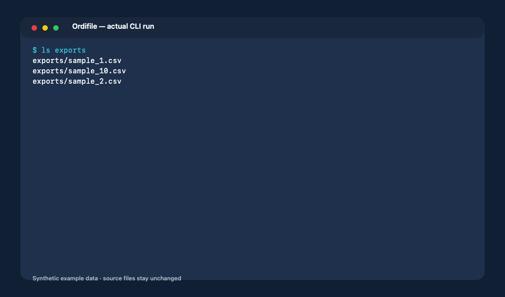
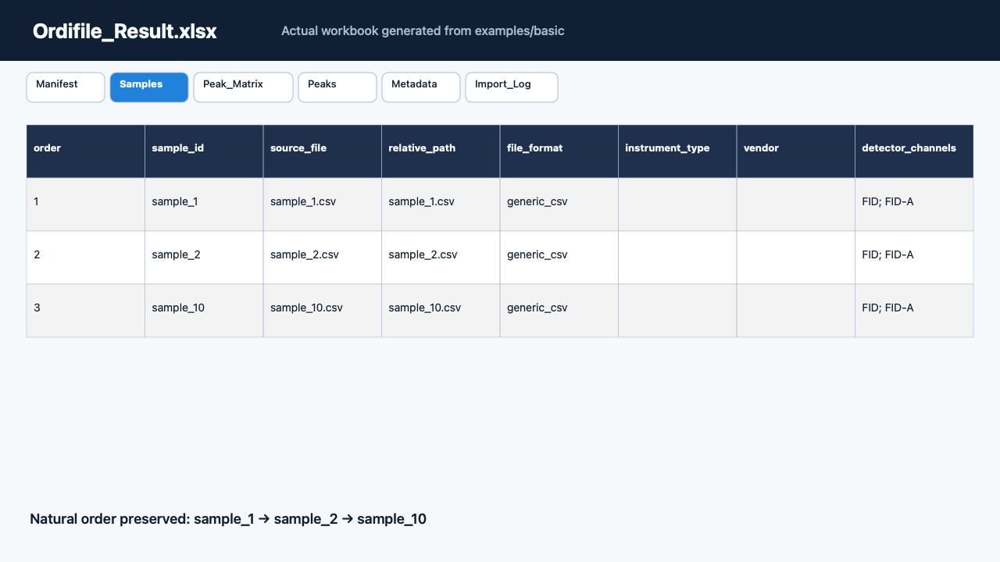

# Ordifile

[English](README.md)

[](https://github.com/hdkim99/ordifile/actions/workflows/ci.yml)
[](https://pypi.org/project/ordifile/)
[](pyproject.toml)
[](LICENSE)

과학 장비 export를 하나의 깔끔하고 정돈되며 감사 가능한 Excel workbook으로 일괄
변환합니다.

**현재 검증됨:** Ordifile 문서 스키마를 사용하는 CSV, TSV, 세미콜론 구분 TXT,
감사된 non-macro XLSX. 제조사 proprietary raw 형식은 v0.1.0에서 지원하지 않습니다.
미출시 source tree에는 아래에 설명한 범위가 매우 좁은 Experimental Agilent
ChemStation `.CH` v181 구조 레코드 decoder가 포함됩니다.



```text
sample_1.csv   sample_2.tsv   exported_peaks.xlsx
          \          |          /
           ordifile convert ...
                    |
                    v
          Ordifile_Result.xlsx
          ├── Manifest
          ├── Samples
          ├── Peak_Matrix
          ├── Peaks
          ├── Metadata
          └── Import_Log
```

## 설치

PyPI에서 검증된 v0.1.0 패키지를 설치합니다.

```bash
python -m pip install --no-cache-dir ordifile==0.1.0
```

## 빠른 시작

```bash
python -c "from pathlib import Path; p=Path('ordifile_demo'); p.mkdir(exist_ok=True); [(p / f'sample_{n}.csv').write_text(f'sample_id,retention_time,area,compound\nsample_{n},{n / 10:.1f},{n * 10},demo\n', encoding='utf-8') for n in (1, 2, 10)]"
ordifile convert ordifile_demo --sort filename --output Ordifile_Result.xlsx
```

이 패키지 독립적인 합성 예제의 실제 결과 요약은 다음과 같습니다.

```text
Input paths: 1
Discovered files: 3
Processed 1/3: success sample_1.csv
Processed 2/3: success sample_2.csv
Processed 3/3: success sample_10.csv
Export started: Ordifile_Result.xlsx
Output ready: Ordifile_Result.xlsx
Status: success
Output: Ordifile_Result.xlsx
Successful files: 3
Files with warnings: 0
Failed files: 0
Duplicate files: 0
Sort requested: filename
Sort used: filename
Sort reason: User requested filename ordering.
Sheets: Manifest, Samples, Peak_Matrix, Peaks, Metadata, Import_Log
```

입력 파일은 수정하지 않습니다. 자연 파일명 정렬은 `sample_10`보다 `sample_2`를
먼저 배치합니다.



## 검증된 형식

| 내장 형식 | Metadata | Peaks | Signals | 상태 | 합성 fixture |
|---|---:|---:|---:|---|---:|
| 일반 comma CSV | 예 | 명시적 열 | 명시적 `time` + `signal` 행 | 검증됨 | 예 |
| 일반 tab TSV | 예 | 명시적 열 | 명시적 `time` + `signal` 행 | 검증됨 | 예 |
| 일반 semicolon TXT | 예 | 명시적 열 | 명시적 `time` + `signal` 행 | 검증됨 | 예 |
| 일반 non-macro XLSX 표 | 예 | 명시적 열 | 명시적 `time` + `signal` 행 | 검증됨 | 예 |

여기서 “일반”은 첫 행이 [문서화된 열 schema](docs/formats/generic-tabular.md)를
사용한다는 뜻이며 임의의 제조사 export를 의미하지 않습니다. 확장자는 보조 근거일
뿐이며 내용과 schema도 함께 확인합니다. 현재 환경의 adapter는
`ordifile formats`로 확인할 수 있습니다.

## Experimental proprietary decoder

| 형식 경계 | Metadata | Peaks | 레코드 출력 | 상태 | 실제 fixture |
|---|---:|---:|---|---|---:|
| Agilent ChemStation `.CH` internal version 181, exact GC-FID profile | 필드별 | 없음 | 모든 구조적 decoded record | Experimental | 외부 BSEE 파일 1개 |

이 Experimental adapter는 PyPI v0.1.0에 포함되지 않습니다. 모든 decoded record를
원래 순서대로 유지합니다. x는 retention time이 아닌 `decoded_record_index`, y는 물리
scale이 적용된 intensity가 아닌 `decoded_raw_integer`입니다. Unit, scientific point
count, 마지막 record의 역할은 아직 미확정입니다. 다른 `.CH` version, `.D` directory,
TCD, MS, peak, 보정값, 쓰기 기능은 지원한다고 주장하지 않습니다. [정확한 기능·안전
경계](https://github.com/hdkim99/ordifile/blob/main/docs/formats/agilent-chemstation-ch-v181.md)를 확인해 주세요.

## CLI

출력 없이 파일 하나를 검사합니다.

```bash
ordifile inspect sample.csv
ordifile inspect exported.xlsx --sheet PeakTable --verbose
```

파일이나 폴더를 변환합니다.

```bash
ordifile convert sample_1.csv sample_2.tsv --output Ordifile_Result.xlsx
ordifile convert ./exports --recursive --sort acquired_at --include-signals \
  --output Ordifile_Result.xlsx
ordifile convert ./exports --extension .csv --extension .xlsx \
  --sheet-mode sidecar-csv --output Ordifile_Result.xlsx
```

주요 동작은 다음과 같습니다.

- 기존 출력은 `--overwrite`가 없으면 덮어쓰지 않습니다.
- 폴더 탐색은 기본적으로 비재귀이며 `--recursive`로 하위 폴더를 포함합니다.
- `--on-error continue`는 정상 파일을 보존하고 부분 성공을 보고합니다.
- `--on-error stop`은 첫 파일 실패 후 중단하며 workbook을 쓰지 않습니다.
- `--adapter`는 adapter를 강제하고 `--sheet`는 XLSX worksheet를 선택합니다.
- signal이 있어도 `--include-signals`를 지정해야 workbook에 기록합니다.
- `--verbose`는 검출 근거와 상세 구조화 진단을 표시합니다.

자동화를 위한 exit code는 다음과 같습니다.

| Code | 의미 |
|---:|---|
| 0 | 실패 파일 없이 workbook 생성 |
| 1 | 치명적 오류 또는 성공 입력 없음 |
| 2 | 사용법 또는 설정 오류 |
| 3 | 하나 이상의 실패 파일이 있지만 유효한 workbook 생성 |
| 130 | 사용자 중단 |

## 정렬

`--sort auto`는 모든 성공 파일에 신뢰 가능한 timezone-aware 측정시각이 있을 때만
측정시각을 사용합니다. 그렇지 않으면 완전한 sequence 번호, 자연 파일명 순으로
fallback합니다. 명시적 모드는 `acquired_at`, `sequence`, `filename`,
`input_order`입니다. 누락되거나 신뢰할 수 없는 값은 기록된 filename fallback을
사용합니다.

요청한 모드, 실제 모드, 사유, 파일별 sort key가 workbook에 기록됩니다.

## Workbook 구조

| Sheet | 내용 |
|---|---|
| `Manifest` | 버전, UTC 생성시각, 개수, 옵션, 정렬, 제한, 경고, sidecar |
| `Samples` | 발견된 입력별 한 행, 상태, 상대경로, adapter, peak 수, SHA-256 |
| `Peak_Matrix` | 명시적 성분명이 있을 때만 시료별 wide format; 중복 peak는 분리 |
| `Peaks` | RT 기반 성분 추론 없이 모든 명시적 peak의 long format |
| `Metadata` | 알 수 없는 필드, 잘못된 raw lexeme, 원래 provenance |
| `Import_Log` | 성공·경고·실패·중복·제외 파일, sort key, hash |
| `Signals_<channel>` | 실제 파싱되고 요청된 경우에만 원본 비보간 x/y 값 |
| `Signals_Records_<channel>` | retention-time signal이 아닌 Experimental 구조 decoded record |

Excel 제한에 도달하기 전에 행과 열을 결정적인 numbered sheet로 나눕니다. 데이터를
조용히 자르지 않습니다. Workbook 저장이 실용적이지 않으면
`--sheet-mode sidecar-csv`로 명시적 CSV sidecar를 만들 수 있으며 Manifest에 상대경로,
행 수, formula escape 수, SHA-256을 기록합니다.

## Python API

CLI와 향후 인터페이스는 같은 공개 API를 사용합니다.

```python
from ordifile.api import convert, inspect_file, list_formats

inspection = inspect_file("sample.csv")
result = convert(
    ["sample_1.csv", "sample_2.tsv"],
    "Ordifile_Result.xlsx",
    sort="auto",
    include_signals=False,
)

print(result.success_count, result.failure_count, result.sort.effective)
```

`convert()`는 폴더, 재귀 탐색, 확장자 필터, 명시적 adapter·XLSX sheet, 오류 정책,
덮어쓰기, CSV sidecar, UI와 독립적인 progress callback도 지원합니다.

## Adapter 추가

외부 패키지는 `ordifile.adapters` Python entry-point group으로 typed adapter를
등록할 수 있습니다. Adapter는 검출과 parsing만 담당하며 worksheet나 CLI 로직을
구현하지 않습니다. 새 형식에는 bounded detection, 기술 근거, 구조화 오류,
재배포 가능한 또는 합성 fixture, 기능별 테스트, 라이선스 검토가 필요합니다.

[Adapter 추가 가이드](docs/formats/adding-an-adapter.md)를 먼저 읽어 주세요. 설치된
외부 adapter는 Python 코드를 실행하므로 신뢰할 수 있는 software로 취급해야 합니다.

처음 기여하기 좋은 작업으로는 합성 delimiter fixture 추가, 오류 메시지 테스트,
문서 번역 개선, 공개 재배포 fixture를 사용한 소규모 adapter 제안이 있습니다.

**조사 중:** YOUNG IN Chromass GC 데이터 형식은 향후 proprietary adapter의 필수
우선 후보입니다. 완료 파일의 의미와 재현 가능한 FID/TCD fixture를 검증하기 전까지
호환성을 주장하지 않습니다.

## 무결성과 보안 경계

- 입력은 read-only로 열고 SHA-256을 기록하며 parsing 후 내용이 바뀌지 않았는지 다시
  확인합니다.
- symbolic link를 거부합니다. 중복 경로와 hard link는 한 번만 parsing하고 기록하며,
  hash가 같다는 이유만으로 서로 다른 파일을 중복 처리하지 않습니다.
- 일반적인 한 파일 parsing 실패는 다른 입력에서 격리됩니다. 정상 데이터로 workbook을
  만들 수 있고 실패 파일은 `Import_Log`에 남습니다.
- formula처럼 보이는 문자열도 literal text로 쓰며 formula와 URL 자동 변환을 끕니다.
- 검증된 XLSX writer/reader 조합에서 정확히 표현할 수 없는 값은 조용히 바꾸지 않고
  해당 파일의 구조화 오류로 처리합니다.
- XLSX audit cell의 source identity는 reversible 표시 encoder를 사용합니다. 안전하지 않은
  code point는 `~uXXXXXX;`가 되고 literal `~`는 두 번 씁니다. Manifest는 정책과 적용 파일
  수를 기록하며 입력 path·bytes·hash는 바뀌지 않습니다.
- CLI는 terminal control과 bidirectional format 문자를 한 줄의 눈에 보이는 escape로
  표시하되 정상 Unicode와 Windows 경로는 그대로 유지합니다.
- XLSX는 openpyxl 전에 ZIP, relationship, Content-Type, XML namespace, 좌표,
  dimension, cell type, resource audit를 통과해야 합니다.
- 일반 변환은 offline으로 동작하고 장비 데이터를 업로드하지 않습니다.

## 제한사항

- v0.1에서는 입력 파일 하나가 시료 하나를 나타냅니다.
- text 입력은 UTF-8 또는 UTF-8 BOM입니다. Adapter별 delimiter가 고정되며 자동 추측하지
  않습니다.
- Extension filter는 discovery 전에 lowercase dotted ASCII로 정규화합니다. 고유 filter는
  최대 32개이며 선행 점 뒤 ASCII suffix는 각 32자입니다. Manifest 표현은 1,024자로
  제한합니다.
- 문서화된 header만 mapping합니다. 단위는 복사하며 변환하지 않습니다.
- retention time에서 성분을 추론하지 않습니다. RT tolerance matching과 중복 성분
  aggregation은 기본 기능이 아닙니다.
- XLSX는 explicit uppercase row/cell 좌표를 가진 감사된 transitional non-macro `.xlsx`
  workbook으로 제한합니다. Template, macro, implicit coordinate, 다른 OOXML 변형은
  거부합니다.
- XLSX formula text는 보존하지만 cached formula 결과를 측정값으로 사용하지 않습니다.
- Numeric Excel date-style cell에는 timezone이 없으므로 자동 측정시각 정렬에서 신뢰
  가능한 값으로 사용하지 않습니다. OOXML `t="d"` ISO timestamp는 audit한 raw lexeme에서
  parsing하며 명시적 offset이 있으면 신뢰 가능한 timestamp가 될 수 있습니다.
- OOXML numeric lexeme는 whitespace 없이 ASCII 부호·소수·지수 문자만 사용해야 합니다.
  Cell type이 문서화된 field와 맞지 않으면 Python 문자열로 바꾸지 않고 raw Metadata와
  경고로 보존합니다.
- 256 MiB 이상 파일은 경고하고 2 GiB 초과 파일은 hash만 계산한 뒤 parsing하지 않습니다.
  Delimited 입력과 선언된 XLSX 비압축 크기는 512 MiB로 제한합니다.
- XLSX audit는 ZIP member 10,000개, control XML part 8 MiB, 물리 행 250,000개,
  물리 cell 1,000,000개, logical row 250,000, projected cell 5,000,000개, XML depth 128,
  raw cell lexeme 32,767자로 추가 제한합니다. Formula raw text는 export literal에 선행 `=`가
  붙으므로 32,766자로 제한합니다.
- Canonical integer는 1,000 decimal digit, integer source lexeme는 4,096자로 제한합니다.
  Excel에서 정확하지 않은 15자리 초과 integer는 literal string으로 쓰고 개수를
  기록합니다.
- 필수 audit cell은 32,767자로 제한합니다. 자기 `Samples`/`Import_Log` identity 또는
  issue summary가 이 한도에 맞지 않는 파일은 workbook planning 전에 격리하며, batch
  summary는 제한된 목록과 생략 code 수를 기록합니다.
- 실용 workbook 제한은 512개 sheet이며 보수적 portable output path 제한은 218 Unicode
  code point입니다.
- v0.1에는 proprietary GC raw parser와 GUI가 없습니다.

이 실용 한도는 Ordifile 안전 정책이며 모든 유효 Excel 파일을 지원한다는 의미가
아닙니다. [정확한 generic 형식 계약](docs/formats/generic-tabular.md)과
[아키텍처 결정](docs/architecture/decision-record.md)을 참고해 주세요.

## 개발

Python 3.11–3.14를 대상으로 합니다. v0.1.0 출시는 Ubuntu, Windows, macOS의 Python
3.11과 3.14에서 검증되었습니다. 현재 지속 CI는 공유 Linux DGX self-hosted runner에서
Python 3.14 하나를 대상으로 하며 Windows 또는 macOS matrix는 운영하지 않습니다. 외부
fork workflow는 유지관리자의 승인 후 같은 장비에서 실행되며 read-only 저장소 권한만
받고 배포 secret이나 OIDC 권한은 받지 않습니다. Runner 가용성은 GitHub Actions에서
확인하는 운영 상태이며, 이 설명은 구성 대상을 뜻할 뿐 현재 online 상태를 보장하지
않습니다.

```bash
python -m pip install -e ".[dev]"
ruff format --check .
ruff check .
mypy
pytest
python -m build
ordifile --help
pip-audit
```

[CONTRIBUTING.md](CONTRIBUTING.md), [SECURITY.md](SECURITY.md),
[릴리스 절차](docs/releasing.md), [GC fixture 조사](docs/research/gc-fixture-search.md),
[외부 fixture 정책](docs/research/external-fixture-policy.md),
[근거 목록](docs/research/source-register.md)을 참고해 주세요. 재배포 권한이 확인되지
않은 proprietary raw 파일이나 fixture를 공개 issue에 첨부하지 마세요.

## 프로젝트명과 상표

Ordifile은 2026-08-16 기술적 충돌 조사 후 선정했습니다. 당시 확인한 GitHub와 package
registry exact-name 검색에서는 기록을 찾지 못했지만, 검색 부재는 이름 예약이나 법적
상표 clearance를 의미하지 않습니다. [이름 변경 조사](docs/research/project-renaming.md)를
참고해 주세요. 향후 호환성 문서에 제조사 이름이 표시되더라도 해당 상표는 각
소유자에게 있으며 제휴나 보증을 의미하지 않습니다.

Agilent, ChemStation, YOUNG IN Chromass, ChroZen, YL-Clarity, AUTOCHRO 및 관련 제품명은 각 소유자의
상표 또는 제품명입니다. Ordifile은 YOUNG IN Chromass와 제휴하지 않으며 그 보증을
받지 않고, Agilent와도 제휴하거나 그 보증을 받지 않습니다.

## 라이선스

Ordifile은 Apache License 2.0으로 배포합니다. [LICENSE](LICENSE),
[NOTICE](NOTICE), [THIRD_PARTY_NOTICES.md](THIRD_PARTY_NOTICES.md)를 확인해 주세요.
